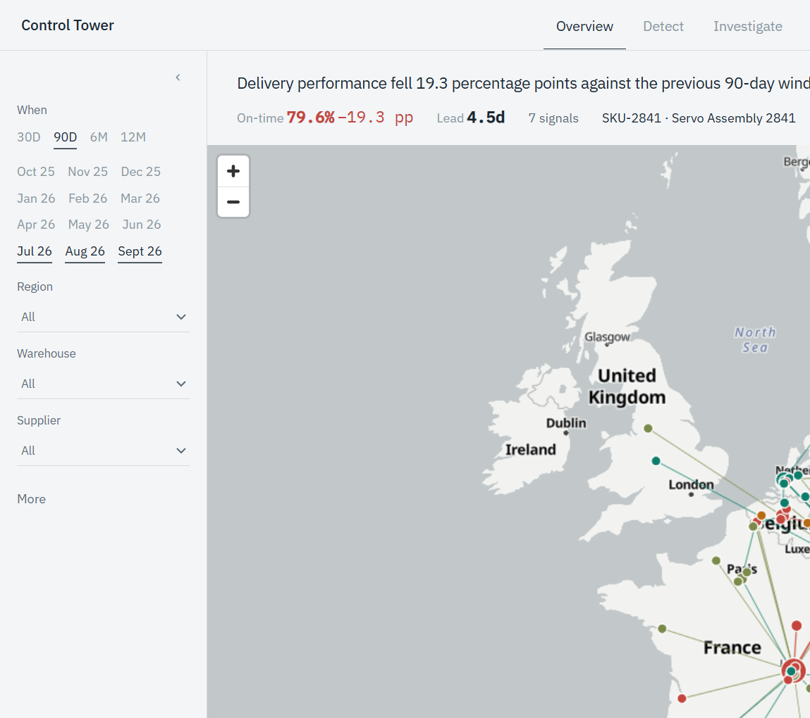
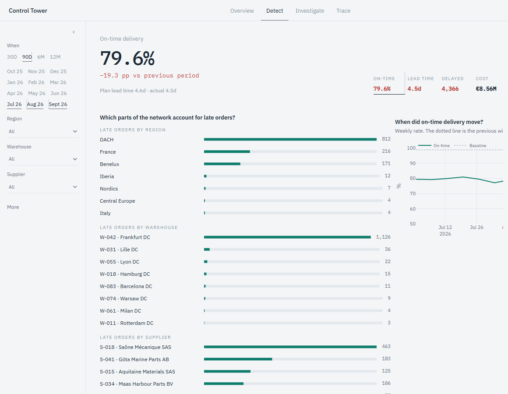
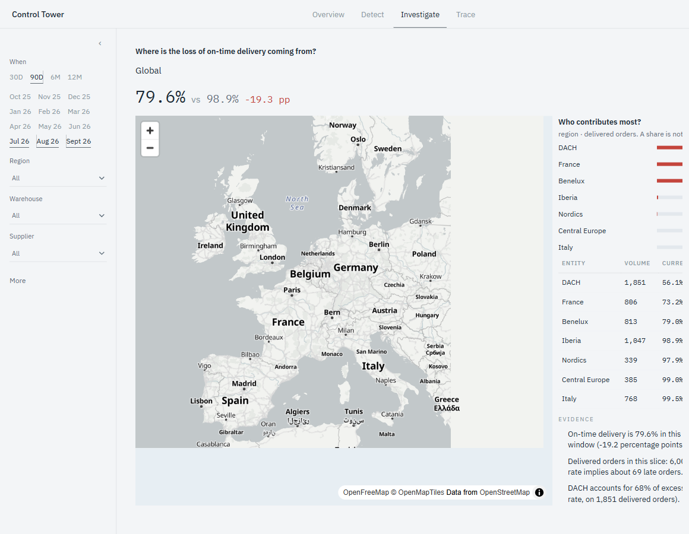
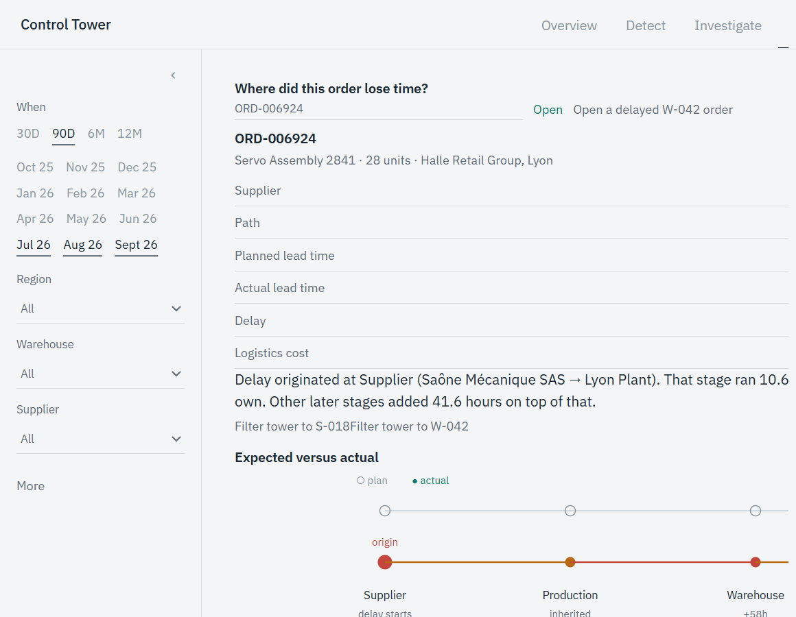

# Supply Chain Control Tower

**Interactive Visual Analytics for Supply Chain Operations**

A mission-control interface for one question: can an analyst see the health of a whole supply chain at a glance, then follow an anomaly down to a single shipment?

The path through the product is one investigation, not five dashboards.

**Overview → Detect → Investigate → Trace**

The network is synthetic, generated with seed 42. Every number on screen is aggregated from those tables. Filters, the map, the anomaly list, the investigation drill, and the order timeline share one selection, so a click in one view changes the others.

## Problem

Operational supply-chain data is usually split across orders, shipments, inventory, and carrier invoices. A late-delivery rate can be true and still useless: it does not say whether the loss sits in one region, one warehouse, one supplier, or one corridor. Analysts end up exporting slices into separate tools and reconstructing the chain by hand.

The cost of that fragmentation is time. By the time the warehouse, the supplier, and the SKU are lined up, the window that produced the exception has moved.

## Approach

The control tower keeps the chain in one exploratory surface.

1. **Overview.** A geographic map and a topology of Supplier → Factory → Warehouse → Hub → Customer. Node size is volume or inventory. Node color is on-time performance.
2. **Detection.** KPIs compare the selected window with the previous window of the same length. Clicking a KPI ranks the entities that account for it.
3. **Localization.** Statistical alerts name the entity, the metric, the expected value, the observed value, and the method.
4. **Explanation.** A drill ranks contribution against each entity’s own baseline. Evidence sentences are counts and rates from the filtered records.
5. **Case.** An order timeline separates the plan from what happened, and marks the stage that started the delay plus any later stage that added hours of its own.

No sentence in the interface is written by a language model. If a number is on screen, it was aggregated from the generated orders, shipments, or inventory snapshots.

## Architecture

```
data/generator     reproducible network, orders, shipments, inventory
backend/app
  analytics        filters, KPIs, trends, network, anomalies, investigation, journey, cost
  api              FastAPI routes and response cache
  services         parquet load
frontend/src
  store            shared filter and drill state
  views            Overview, Detect, Investigate, Trace
  visualizations   MapLibre map, D3 topology and timeline, Plotly trends
```

The browser never receives the raw shipment table (120,000 legs). Each endpoint returns an aggregation for the current selection. The API keeps a small in-memory cache of those aggregations.

```
Browser filters  →  /api/*  →  analytics  →  parquet
       ↑                                     
       └──────── one Zustand selection ──────┘
```

### Stack

| Layer | Tools |
| --- | --- |
| Interface | React, TypeScript, Vite, Tailwind CSS |
| Maps and charts | MapLibre GL, D3, Plotly.js |
| State | Zustand, TanStack Query |
| API | FastAPI, Pydantic |
| Analytics | pandas, NumPy, NetworkX, scikit-learn |

## Synthetic dataset

`data/generator/generate.py` builds a fictional European network with seed **42**. The same files are produced on API startup when `data/generated/` is empty.

| Entity | Count |
| --- | --- |
| Suppliers | 50 |
| Factories | 5 |
| Warehouses | 10 |
| Distribution hubs | 15 |
| Products | 100 |
| Customers | 30 |
| Orders | 30,000 |
| Shipment legs | 120,000 |

The calendar runs from 1 October 2025 through 30 September 2026. The default view is the last 90 days (3 July 2026 – 30 September 2026). The baseline is the 90 days immediately before that.

Five situations are injected into the generator so the detectors have something real to find. The UI does not read that list. It only sees the resulting timestamps, costs, and stock.

| Situation | What the data does | What the default window reports |
| --- | --- | --- |
| Supplier S-018 | Dispatch on-time rate falls after 3 July 2026 | 74.3% versus a 94.2% history |
| Warehouse W-042 | Inbound cycle time steps from about 2.8 days to about 5.1 days | 5.1 days versus a 2.7 day baseline |
| SKU-2841 | Receipts stop while demand continues | 1.8 days of cover at Frankfurt DC |
| Corridor W-055 → H-330 | Cost per kilometre jumps from 1 August 2026 | about 2.5× the earlier rate |
| France last mile | Extra delay on a fraction of customer deliveries from 1 August 2026 | regional on-time rate falls |

End-to-end on-time delivery in the default window is **79.6%**, against **98.9%** in the previous window. DACH accounts for most of that gap, and inside DACH the contribution is Frankfurt DC (W-042). Benelux also alerts. That is a measured spillover: W-042 serves Brussels, so the warehouse shock shows up in a second region. It is not a sixth scripted message.

## Analytical features

**Anomaly detection** uses methods an analyst can restate:

- Rolling four-week on-time rate versus the previous window, with a z-score and a minimum volume (suppliers and regions).
- Inbound cycle-time z-score against the warehouse’s own baseline.
- Interquartile fence on cost per kilometre, plus a residual from a linear model of distance, mode, and quantity (scikit-learn).
- Days of cover versus safety stock, using trailing 28-day demand. Tiny SKUs are ignored.

Each alert carries severity, entity, metric, expected value, observed value, deviation, method, and timestamp. Opening an alert applies its filters and opens the investigation at the matching drill.

**Root-cause contribution** is the share of excess (late orders, extra lead time, extra cost, or units below safety cover) relative to each entity’s own baseline. Rows with too little history fall back to the global baseline. The breadcrumb is the drill: Global → region → warehouse → supplier → product → shipment.

**Order journey** rebuilds six stages from the four shipment legs: supplier dispatch, production dwell, warehouse inbound, line-haul to the hub, distribution dwell, and customer delivery. The origin is the first stage that ran more than eight hours over its own plan. Later stages that add their own hours are marked separately from stages that only inherited an earlier slip.

## Screenshots

Overview, last 90 days. The health line and the map use the same window. Node color is on-time performance.



Detect. On-time delivery is 79.6%, 19.3 percentage points under the previous window. The longest bar is the place that accounts for the most late orders.



Investigate. The full network stays on screen. The ranking beside it is a share of the gap, not a cause.



Trace for ORD-006924. Hollow marks are the plan. The line drops at the stage that starts the delay.



## API

Interactive docs: [http://127.0.0.1:8010/docs](http://127.0.0.1:8010/docs)

| Endpoint | Role |
| --- | --- |
| `GET /api/meta` | Date bounds, default window, counts, example order |
| `GET /api/filters/options` | Regions, countries, suppliers, warehouses, products, modes, statuses |
| `GET /api/kpis` | Orders, on-time delivery, inventory value, lead time, delayed shipments, cost, alerts, each with a baseline delta |
| `GET /api/performance/trends` | Weekly on-time series, lead-time histogram, volume, inventory, cost by mode, supplier bars |
| `GET /api/performance/breakdown` | Ranked contribution for the KPI that was clicked |
| `GET /api/network` | Nodes and flows for the map and the topology |
| `GET /api/anomalies` | Alerts for the selection |
| `GET /api/investigation` | Drill state via repeated `drill=dimension:value` |
| `GET /api/orders/search` | Order lookup |
| `GET /api/orders/{order_id}/journey` | Stage timeline |
| `GET /api/inventory` | Value by warehouse, category, and region |
| `GET /api/costs` | Cost versus service for suppliers and routes |

Query parameters are validated. An inverted date range returns 422. Dates outside the generated calendar are clamped.

## Run

Python 3.12 and Node 22 were used to build this project.

```bash
python -m venv .venv
.venv\Scripts\python.exe -m pip install -r backend/requirements.txt
.venv\Scripts\python.exe -m data.generator.generate

.venv\Scripts\python.exe -m uvicorn app.main:app --app-dir backend --host 127.0.0.1 --port 8010
```

In a second terminal:

```bash
cd frontend
npm install
npm run dev
```

Open [http://127.0.0.1:5173](http://127.0.0.1:5173). Vite proxies `/api` to port **8010**.

The generator is optional. If the parquet files are missing, the API writes them on startup. Regenerating is deterministic for seed 42.

```bash
.venv\Scripts\python.exe -m pytest -q
cd frontend && npm run build
```

## A path to walk

1. Stay on **Overview**. The health line and the issue list come from the live KPIs and anomaly API. Click an issue to locate it on the map. The context panel stays on this screen until you choose Investigate.
2. Open **Detect**. On-time delivery is the hero signal. Ranked bars show where the gap sits. Anomaly cards sit under the time series.
3. **Investigate** opens with the selection already applied. The breadcrumb is the drill. Shares are contribution, not a cause.
4. **Trace** loads one order. Hollow marks are the plan. A stage is marked as the origin, as added delay, or as inherited.
5. **Walk a disruption** follows that same path from a real alert. Exit at any step.

Changing the month chips or the header arrows recomputes every view that uses the time window, including which alerts exist. January 2026 does not contain the July shocks.

## Limitations

- The network, orders, and shipments are synthetic. They are shaped to be operationally plausible, not taken from a carrier or an ERP.
- Detection is statistical: z-scores, a rolling baseline, an interquartile fence, and a linear cost residual. There is no learned anomaly model and no claim that a threshold is optimal.
- A shock at one warehouse can light up every region that warehouse serves. Benelux is that case. The alert is honest, and it is also a reminder that a regional rate is not a root cause.
- Inventory value is a snapshot at the end of the selected window, restricted to warehouses and SKUs present in the filtered orders.
- The geographic basemap is the light [OpenFreeMap](https://openfreemap.org/) Positron style. The topology view does not need it.

## Future work

- Forecast demand and inbound receipts so stock-out alerts arrive before cover falls under a week.
- Graph anomaly detection on the shipment network, using the NetworkX graph that already feeds betweenness.
- Rebalancing and mode-shift options, using the cost and service figures the API already returns.
- Scenario simulation: move a corridor, close a warehouse, or restore S-018’s historical dispatch rate and recompute the KPIs.
- A streaming ingest so the same investigation runs on live events instead of a generated year.
